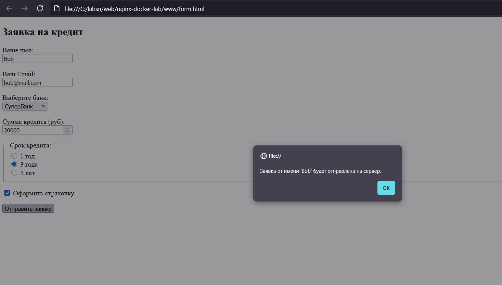
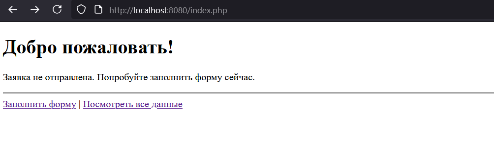

# Лабораторная работа №3: Обработка веб-форм с помощью PHP

## 👩‍💻 Автор
Федорова Наталья, группа 3МО-2

---

## 📌 Описание задания
Создание и обработка веб-формы на стороне сервера с использованием PHP. Работа включает в себя валидацию данных, использование сессий для передачи информации между страницами и сохранение полученных данных в текстовый файл.
  
Результат доступен по адресам:
- Главная страница: [http://localhost:8080/index.php](http://localhost:8080/index.php)
- Форма для заполнения: [http://localhost:8080/form.html](http://localhost:8080/form.html)
- Просмотр всех записей: [http://localhost:8080/view.php](http://localhost:8080/view.php)

---

## ⚙️ Как запустить проект

1.  Клонировать репозиторий:
    ```bash
    git clone https://github.com/limongus/nginx-docker-lab
    cd nginx-lab
    ```
2.  Запустить контейнеры:
    ```bash
    docker-compose up -d --build
    ```
3.  Открыть сайт в браузере по ссылкам выше.

---

## 📂 Содержимое проекта

*   `docker-compose.yml` — описание сервиса Nginx и PHP-FPM.
*   `nginx/default.conf` — конфигурация Nginx для обработки PHP.
*   `form.html` — HTML-страница с формой заявки.
*   `index.php` — Главная страница, отображает данные из сессии и ошибки валидации.
*   `process.php` — Серверный обработчик формы (валидация, сессии, запись в файл).
*   `view.php` — Страница для просмотра всех сохраненных заявок.
*   `data.txt` — Файл для хранения данных, полученных из формы.
*   `screenshots/` — Скриншоты работы проекта.

---

## 📸 Скриншоты работы

1. Вывод данных из сессии на главной странице


*Отправка формы*

*После успешной отправки информация появляется на `index.php`*

2. Просмотр всех сохраненных записей


*Страница `view.php` читает данные из `data.txt` и выводит их в виде таблицы.*

3. Обработка ошибок валидации


*Не отправленная заявка*

✅ Результат
---
Реализована обработка веб-формы на стороне сервера с помощью PHP. Данные, отправленные пользователем, проходят валидацию. Корректные данные сохраняются в файл на сервере, а также передаются между страницами с помощью механизма сессий. В случае ошибок пользователь получает информативное сообщение.