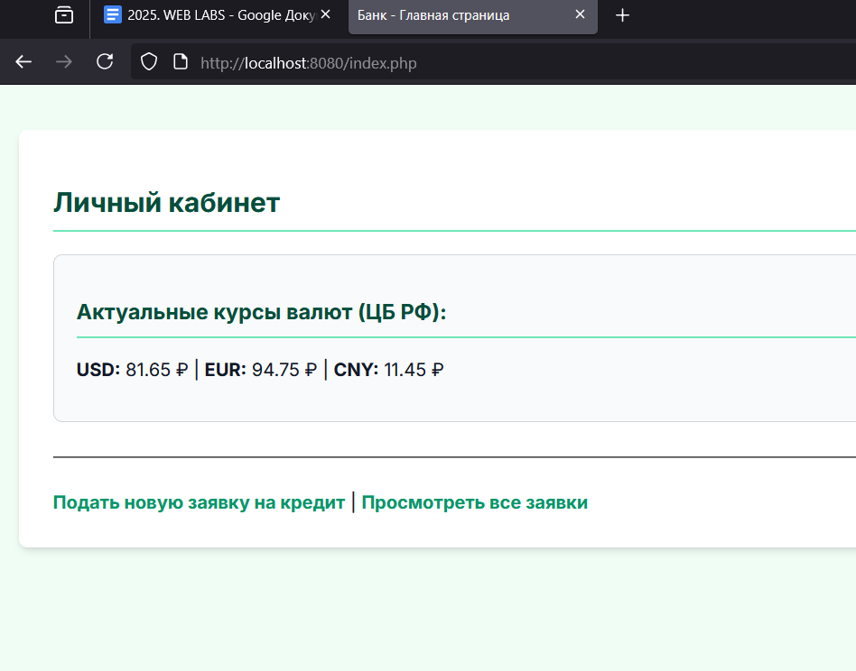
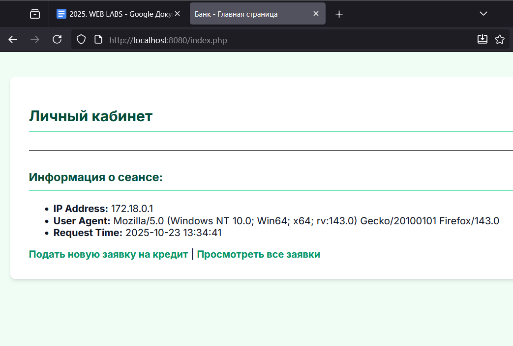

# Лабораторная работа №4: Composer, классы и работа с публичным API


## 👩‍💻 Автор
Федорова Наталья, группа 3МО-2

---

## 📌 Описание задания
Целью работы было расширение существующего проекта: освоение менеджера зависимостей **Composer** для подключения внешних библиотек, рефакторинг кода с использованием **PHP-классов** и интеграция **публичного API** для получения и отображения данных из внешнего источника.
  
Результат доступен по адресу:
- Главная страница: [http://localhost:8080](http://localhost:8080)

---

## ⚙️ Как запустить проект

1.  Клонировать репозиторий:
    ```bash
    git clone https://github.com/limongus/nginx-docker-lab.git
    cd nginx-docker-lab 
    ```
2.  **Установить PHP-зависимости:**
    ```bash
    docker-compose run --rm php composer install
    ```
3.  Запустить контейнеры:
    ```bash
    docker-compose up -d --build
    ```
4.  Открыть сайт в браузере.

---

## 📂 Новое в проекте

*   `composer.json` / `composer.lock` — Файлы конфигурации Composer, описывающие зависимости проекта.
*   `vendor/` — Директория с установленными библиотеками (в частности, `guzzlehttp/guzzle`).
*   `ApiClient.php` — **Новый класс**, отвечающий за выполнение HTTP-запросов к внешним API.
*   `UserInfo.php` — **Новый класс**, инкапсулирующий логику сбора информации о пользователе (IP, User-Agent).
*   *Изменения в `process.php`*: Теперь скрипт использует `ApiClient` для запроса данных и устанавливает `cookie`.
*   *Изменения в `index.php`*: Страница теперь отображает данные из API и информацию из `UserInfo` и `cookie`.

---

## 📸 Скриншоты работы

### 1. Интеграция API
После успешной отправки формы на главной странице отображаются динамические данные (например, курсы валют), полученные через `ApiClient` из внешнего источника.


*Данные, полученные из API*

### 2. Информация о пользователе и Cookie
На главной странице теперь также выводится блок с информацией о сеансе пользователя (IP, User-Agent) и временем последней отправки данных, которое хранится в cookie.


*Класс UserInfo и cookie*

---

## ✅ Результат

В ходе работы были успешно применены современные практики PHP-разработки. Проект теперь использует **Composer** для управления зависимостями. Логика инкапсулирована в **классы** (`ApiClient`, `UserInfo`), что делает код более чистым и масштабируемым. Реализована интеграция с **внешним публичным API**, а также продемонстрирована работа с **cookie** для сохранения информации между запросами пользователя.