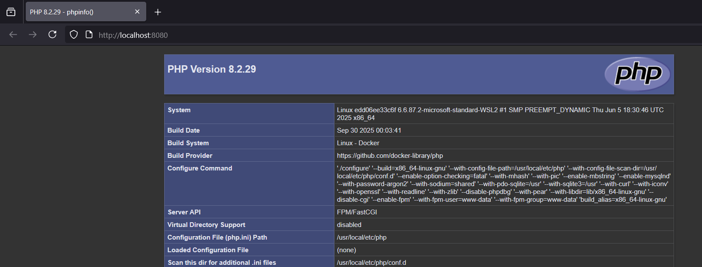
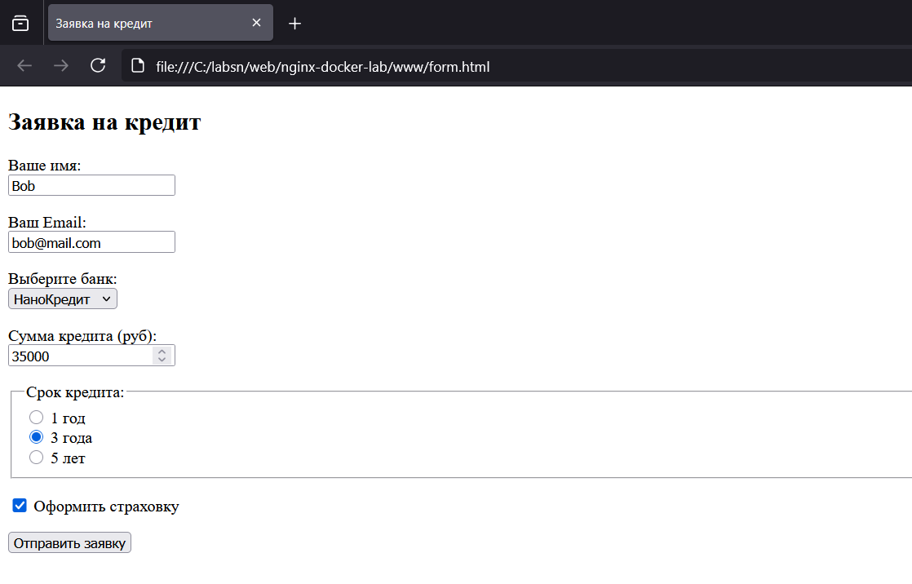
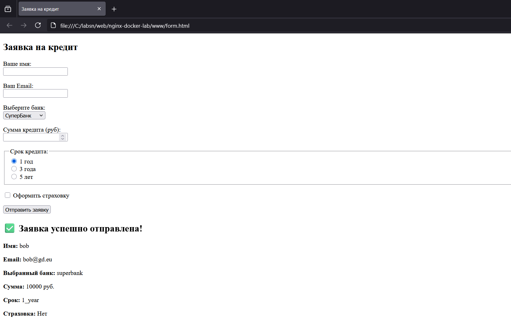

# Лабораторная работа №2: Nginx + PHP-FPM + JS Forms

## 👩‍💻 Автор
Федорова Наталья, группа 3МО-2

---

## 📌 Описание задания
Настройка Nginx + PHP-FPM. Основы HTML-форм и обработка на JavaScript.
  
Результат доступен по адресам:
- Проверка PHP: [http://localhost:8080/index.php](http://localhost:8080/index.php)
- Форма регистрации: [http://localhost:8080/form.html](http://localhost:8080/form.html)

---

## ⚙️ Как запустить проект

1. Клонировать репозиторий:
   ```bash
   git clone https://github.com/rpaup/nginx-lab.git
   cd nginx-lab
Запустить контейнеры:
```bash
docker-compose up -d --build
```
Открыть в сайт браузере.

📂 Содержимое проекта

```docker-compose.yml``` — описание сервиса Nginx и PHP-FPM
```code/index.html``` — главная HTML-страница
```nginx/default.conf``` — конфигурация Nginx для обработки статики и PHP
```www/``` — код сайта
```screenshots/``` — все скриншоты


📸 Скриншоты работы

1. Проверка работы PHP



2. Создание HTML-формы



3. Обработка формы на JavaScript



✅ Результат
Инфраструктура в Docker развёрнута. Nginx корректно обрабатывает статику и PHP-скрипты. Интерактивная форма на JavaScript работает согласно заданию.